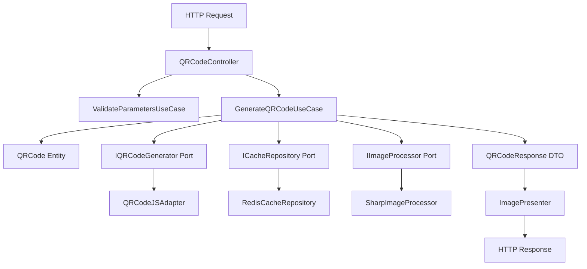

# QR Code Generator API - System Analysis Document
**Clean Architecture Implementation**

---

## Document Information
- **Project:** QR Code Generator API
- **Document Type:** System Analysis (SA)
- **Architecture Pattern:** Clean Architecture
- **Version:** 1.0
- **Created By:** Senior System Analyst
- **Review Date:** 01-08-2025
- **Approval Status:** Approval

---

## Table of Contents

1. [System Overview](#1-system-overview)
2. [Architecture Design](#2-architecture-design)
3. [Domain Analysis](#3-domain-analysis)
4. [Technical Specifications](#4-technical-specifications)
5. [Data Architecture](#5-data-architecture)
6. [API Architecture](#6-api-architecture)
7. [Security Architecture](#7-security-architecture)
8. [Performance Architecture](#8-performance-architecture)
9. [Deployment Architecture](#9-deployment-architecture)
10. [Implementation Roadmap](#10-implementation-roadmap)

---

## 1. System Overview

### 1.1 System Purpose
QR Code Generator API là một RESTful service được thiết kế để tạo QR code động với khả năng tùy biến cao, hỗ trợ multiple output formats và tích hợp dễ dàng vào các hệ thống enterprise.

### 1.2 Architecture Philosophy
Hệ thống được thiết kế theo **Clean Architecture** principles:

- **Independence of Frameworks**: Business logic độc lập với technology stack
- **Testability**: High test coverage với isolated components
- **Independence of UI**: API layer có thể thay đổi không ảnh hưởng core logic
- **Independence of Database**: Flexible data storage options
- **Independence of External Services**: Pluggable external dependencies

### 1.3 Quality Attributes
- **Performance**: Response time < 500ms, throughput 10,000+ req/day
- **Scalability**: Horizontal scaling capability
- **Reliability**: 99.5% uptime, graceful error handling
- **Security**: Input validation, rate limiting, audit logging
- **Maintainability**: Clean code, comprehensive testing, documentation

## 2. Architecture Design

### 2.1 Clean Architecture Layers

```
┌─────────────────────────────────────────────────────────────┐
│                    Frameworks & Drivers                     │
│  ┌─────────────────────────────────────────────────────┐   │
│  │            Interface Adapters                        │   │
│  │  ┌─────────────────────────────────────────────┐   │   │
│  │  │           Application Business Rules         │   │   │
│  │  │  ┌─────────────────────────────────────┐   │   │   │
│  │  │  │    Enterprise Business Rules       │   │   │   │
│  │  │  │         (Entities)                 │   │   │   │
│  │  │  └─────────────────────────────────────┘   │   │   │
│  │  │           (Use Cases)                      │   │   │
│  │  └─────────────────────────────────────────────┘   │   │
│  │    (Controllers, Gateways, Presenters)             │   │
│  └─────────────────────────────────────────────────────┘   │
│     (Web, DB, External Interfaces)                         │
└─────────────────────────────────────────────────────────────┘
```

### 2.2 Layer Responsibilities

#### 2.2.1 Entities Layer (Enterprise Business Rules)
```
/src/domain/entities/
├── QRCode.ts                    # Core QR Code business entity
├── QRCodeConfiguration.ts       # Configuration value object
├── ValidationResult.ts          # Validation result entity
└── valueObjects/
    ├── Size.ts                  # Size validation and operations
    ├── ColorValue.ts            # Color parsing and validation
    ├── ErrorCorrectionLevel.ts  # ECC enum and logic
    ├── OutputFormat.ts          # Supported formats
    └── DataPayload.ts           # Data content validation
```

#### 2.2.2 Use Cases Layer (Application Business Rules)
```
/src/application/
├── usecases/
│   ├── GenerateQRCodeUseCase.ts      # Main QR generation workflow
│   ├── ValidateParametersUseCase.ts   # Parameter validation logic
│   ├── CacheManagementUseCase.ts     # Cache operations
│   └── OptimizeImageUseCase.ts       # Image optimization logic
├── ports/
│   ├── IQRCodeGenerator.ts           # QR generation interface
│   ├── IImageProcessor.ts            # Image processing interface
│   ├── ICacheRepository.ts           # Caching interface
│   ├── ILogger.ts                    # Logging interface
│   └── IMetricsCollector.ts          # Metrics collection interface
└── dto/
    ├── QRCodeRequest.ts              # Input DTO
    └── QRCodeResponse.ts             # Output DTO
```

#### 2.2.3 Interface Adapters Layer
```
/src/infrastructure/adapters/
├── controllers/
│   ├── QRCodeController.ts           # HTTP request handling
│   └── HealthController.ts           # Health check endpoint
├── repositories/
│   ├── RedisCacheRepository.ts       # Redis cache implementation
│   ├── InMemoryCacheRepository.ts    # In-memory cache fallback
│   └── FileSystemCacheRepository.ts  # File-based cache option
├── external/
│   ├── QRCodeJSAdapter.ts           # qrcode.js library adapter
│   ├── SharpImageProcessor.ts        # Sharp.js image processing
│   ├── JimpImageProcessor.ts         # Jimp fallback processor
│   └── WinstonLogger.ts              # Winston logging adapter
├── validators/
│   ├── RequestValidator.ts           # Input validation
│   └── BusinessRuleValidator.ts      # Business logic validation
└── presenters/
    ├── ImagePresenter.ts             # Image response formatting
    └── ErrorPresenter.ts             # Error response formatting
```

#### 2.2.4 Frameworks & Drivers Layer
```
/src/infrastructure/web/
├── server.ts                         # Application entry point
├── app.ts                           # Express app configuration
├── routes/
│   ├── qrCodeRoutes.ts              # QR code endpoints
│   ├── healthRoutes.ts              # Health check routes
│   └── metricsRoutes.ts             # Metrics endpoints
├── middleware/
│   ├── rateLimiter.ts               # Rate limiting middleware
│   ├── errorHandler.ts              # Global error handling
│   ├── requestLogger.ts             # Request logging
│   ├── cors.ts                      # CORS configuration
│   ├── compression.ts               # Response compression
│   └── securityHeaders.ts           # Security headers
├── config/
│   ├── database.ts                  # Database configuration
│   ├── cache.ts                     # Cache configuration
│   ├── security.ts                  # Security settings
│   └── monitoring.ts                # Monitoring configuration
└── container/
    └── DIContainer.ts               # Dependency injection setup
```

### 2.3 Dependency Flow Diagram



## 3. Domain Analysis

### 3.1 Core Domain Entities

#### 3.1.1 QRCode Entity
```typescript
export class QRCode {
  private readonly _id: string;
  private readonly _data: DataPayload;
  private readonly _configuration: QRCodeConfiguration;
  private readonly _createdAt: Date;

  constructor(data: string, options: QRCodeOptions = {}) {
    this._id = this.generateId();
    this._data = new DataPayload(data);
    this._configuration = new QRCodeConfiguration(options);
    this._createdAt = new Date();
    
    this.validateBusinessRules();
  }

  // Business Rules
  private validateBusinessRules(): void {
    this.validateDataLength();
    this.validateColorContrast();
    this.validateSizeConstraints();
  }

  private validateDataLength(): void {
    const maxLength = this.calculateMaxDataLength();
    if (this._data.length > maxLength) {
      throw new DomainError(
        'DATA_TOO_LONG',
        `Data length ${this._data.length} exceeds maximum ${maxLength} for ECC level ${this._configuration.errorCorrectionLevel.value}`
      );
    }
  }

  private validateColorContrast(): void {
    const contrast = this._configuration.calculateColorContrast();
    if (contrast < 4.5) { // WCAG AA standard
      throw new DomainError(
        'INSUFFICIENT_CONTRAST',
        `Color contrast ratio ${contrast} is below minimum 4.5`
      );
    }
  }

  private calculateMaxDataLength(): number {
    // Business logic for calculating max data length based on ECC level
    const eccMultipliers = {
      'L': 1.0,
      'M': 0.8,
      'Q': 0.65,
      'H': 0.55
    };
    return Math.floor(900 * eccMultipliers[this._configuration.errorCorrectionLevel.value]);
  }

  // Getters
  get id(): string { return this._id; }
  get data(): DataPayload { return this._data; }
  get configuration(): QRCodeConfiguration { return this._configuration; }
  get createdAt(): Date { return this._createdAt; }

  // Domain Methods
  public generateCacheKey(): string {
    return crypto
      .createHash('sha256')
      .update(JSON.stringify({
        data: this._data.value,
        config: this._configuration.toObject()
      }))
      .digest('hex');
  }

  public isComplexQRCode(): boolean {
    return this._data.length > 200 || 
           this._configuration.size.width > 500 ||
           this._configuration.errorCorrectionLevel.value === 'H';
  }
}
```

#### 3.1.2 QRCodeConfiguration Value Object
```typescript
export class QRCodeConfiguration {
  private readonly _size: Size;
  private readonly _color: ColorValue;
  private readonly _backgroundColor: ColorValue;
  private readonly _errorCorrectionLevel: ErrorCorrectionLevel;
  private readonly _outputFormat: OutputFormat;
  private readonly _margin: number;
  private readonly _quietZone: number;
  private readonly _charsetSource: string;
  private readonly _charsetTarget: string;

  constructor(options: QRCodeOptions) {
    this._size = new Size(options.size || '200x200');
    this._color = new ColorValue(options.color || '0-0-0');
    this._backgroundColor = new ColorValue(options.bgcolor || '255-255-255');
    this._errorCorrectionLevel = new ErrorCorrectionLevel(options.ecc || 'L');
    this._outputFormat = new OutputFormat(options.format || 'png');
    this._margin = this.validateMargin(options.margin || 1);
    this._quietZone = this.validateQuietZone(options.qzone || 0);
    this._charsetSource = options.charsetSource || 'UTF-8';
    this._charsetTarget = options.charsetTarget || 'UTF-8';
  }

  public calculateColorContrast(): number {
    return this._color.calculateContrastRatio(this._backgroundColor);
  }

  public toGeneratorOptions(): QRGeneratorOptions {
    return {
      errorCorrectionLevel: this._errorCorrectionLevel.value,
      width: this._size.width,
      height: this._size.height,
      color: {
        dark: this._color.toHex(),
        light: this._backgroundColor.toHex()
      },
      margin: this._margin,
      type: this._outputFormat.toGeneratorType()
    };
  }

  // Getters
  get size(): Size { return this._size; }
  get color(): ColorValue { return this._color; }
  get backgroundColor(): ColorValue { return this._backgroundColor; }
  get errorCorrectionLevel(): ErrorCorrectionLevel { return this._errorCorrectionLevel; }
  get outputFormat(): OutputFormat { return this._outputFormat; }
  get margin(): number { return this._margin; }
  get quietZone(): number { return this._quietZone; }
}
```

### 3.2 Value Objects

#### 3.2.1 Size Value Object
```typescript
export class Size {
  private readonly _width: number;
  private readonly _height: number;

  constructor(sizeString: string) {
    const parsed = this.parseSize(sizeString);
    this.validateSize(parsed);
    this._width = parsed.width;
    this._height = parsed.height;
  }

  private parseSize(sizeString: string): {width: number, height: number} {
    const match = sizeString.match(/^(\d+)x(\d+)$/);
    if (!match) {
      throw new DomainError('INVALID_SIZE_FORMAT', `Size must be in format WxH, got: ${sizeString}`);
    }
    
    return {
      width: parseInt(match[1], 10),
      height: parseInt(match[2], 10)
    };
  }

  private validateSize(size: {width: number, height: number}): void {
    if (size.width !== size.height) {
      throw new DomainError('NON_SQUARE_SIZE', 'QR codes must be square');
    }

    if (size.width < 10 || size.width > 1000) {
      throw new DomainError('SIZE_OUT_OF_RANGE', `Size must be between 10x10 and 1000x1000`);
    }
  }

  get width(): number { return this._width; }
  get height(): number { return this._height; }
  
  public isSquare(): boolean { return this._width === this._height; }
  public getArea(): number { return this._width * this._height; }
  public toString(): string { return `${this._width}x${this._height}`; }
}
```

#### 3.2.2 ColorValue Value Object
```typescript
export class ColorValue {
  private readonly _red: number;
  private readonly _green: number;
  private readonly _blue: number;

  constructor(colorString: string) {
    const rgb = this.parseColor(colorString);
    this.validateRGB(rgb);
    this._red = rgb.red;
    this._green = rgb.green;
    this._blue = rgb.blue;
  }

  private parseColor(colorString: string): {red: number, green: number, blue: number} {
    // RGB Decimal format: "255-0-0"
    const decimalMatch = colorString.match(/^(\d+)-(\d+)-(\d+)$/);
    if (decimalMatch) {
      return {
        red: parseInt(decimalMatch[1], 10),
        green: parseInt(decimalMatch[2], 10),
        blue: parseInt(decimalMatch[3], 10)
      };
    }

    // Hex format: "f00" or "FF0000"
    const hexMatch = colorString.match(/^([a-fA-F0-9]{3}|[a-fA-F0-9]{6})$/);
    if (hexMatch) {
      return this.parseHexColor(hexMatch[1]);
    }

    throw new DomainError('INVALID_COLOR_FORMAT', `Invalid color format: ${colorString}`);
  }

  private parseHexColor(hex: string): {red: number, green: number, blue: number} {
    if (hex.length === 3) {
      return {
        red: parseInt(hex[0] + hex[0], 16),
        green: parseInt(hex[1] + hex[1], 16),
        blue: parseInt(hex[2] + hex[2], 16)
      };
    }
    
    return {
      red: parseInt(hex.substr(0, 2), 16),
      green: parseInt(hex.substr(2, 2), 16),
      blue: parseInt(hex.substr(4, 2), 16)
    };
  }

  public calculateContrastRatio(other: ColorValue): number {
    const luminance1 = this.getLuminance();
    const luminance2 = other.getLuminance();
    const brighter = Math.max(luminance1, luminance2);
    const darker = Math.min(luminance1, luminance2);
    return (brighter + 0.05) / (darker + 0.05);
  }

  private getLuminance(): number {
    const sRGB = [this._red, this._green, this._blue].map(c => {
      c = c / 255;
      return c <= 0.03928 ? c / 12.92 : Math.pow((c + 0.055) / 1.055, 2.4);
    });
    return 0.2126 * sRGB[0] + 0.7152 * sRGB[1] + 0.0722 * sRGB[2];
  }

  get red(): number { return this._red; }
  get green(): number { return this._green; }
  get blue(): number { return this._blue; }

  public toHex(): string {
    return `#${this._red.toString(16).padStart(2, '0')}${this._green.toString(16).padStart(2, '0')}${this._blue.toString(16).padStart(2, '0')}`;
  }

  public toRGB(): string {
    return `${this._red}-${this._green}-${this._blue}`;
  }
}
```

## 4. Technical Specifications

### 4.1 Use Case Implementation

#### 4.1.1 GenerateQRCodeUseCase
```typescript
export class GenerateQRCodeUseCase {
  constructor(
    private readonly qrGenerator: IQRCodeGenerator,
    private readonly imageProcessor: IImageProcessor,
    private readonly cacheRepository: ICacheRepository,
    private readonly logger: ILogger,
    private readonly metricsCollector: IMetricsCollector
  ) {}

  async execute(request: QRCodeRequest): Promise<QRCodeResponse> {
    const startTime = Date.now();
    
    try {
      // 1. Create domain entity with business rule validation
      this.logger.info('Creating QR code entity', { data: request.data });
      const qrCode = new QRCode(request.data, request.options);

      // 2. Check cache first
      const cacheKey = qrCode.generateCacheKey();
      const cachedResult = await this.cacheRepository.get(cacheKey);
      
      if (cachedResult) {
        this.logger.info('Cache hit', { cacheKey });
        this.metricsCollector.incrementCounter('qr_generation_cache_hit');
        return cachedResult;
      }

      // 3. Generate QR code matrix
      this.logger.info('Generating QR code matrix');
      const qrMatrix = await this.qrGenerator.generate(qrCode);

      // 4. Process image to desired format
      this.logger.info('Processing image', { format: qrCode.configuration.outputFormat.value });
      const processedImage = await this.imageProcessor.process(qrMatrix, qrCode.configuration);

      // 5. Create response
      const response = new QRCodeResponse(
        processedImage.buffer,
        qrCode.configuration.outputFormat.getMimeType(),
        qrCode.configuration.outputFormat.value
      );

      // 6. Cache the result
      const cacheTTL = this.calculateCacheTTL(qrCode);
      await this.cacheRepository.set(cacheKey, response, cacheTTL);

      // 7. Record metrics
      const duration = Date.now() - startTime;
      this.metricsCollector.recordHistogram('qr_generation_duration', duration);
      this.metricsCollector.incrementCounter('qr_generation_success');

      this.logger.info('QR code generated successfully', { 
        duration, 
        format: qrCode.configuration.outputFormat.value,
        size: qrCode.configuration.size.toString()
      });

      return response;

    } catch (error) {
      const duration = Date.now() - startTime;
      this.metricsCollector.recordHistogram('qr_generation_duration', duration);
      this.metricsCollector.incrementCounter('qr_generation_error');
      
      this.logger.error('QR code generation failed', {
        error: error.message,
        stack: error.stack,
        duration,
        request
      });

      throw error;
    }
  }

  private calculateCacheTTL(qrCode: QRCode): number {
    // Dynamic TTL based on QR code complexity
    if (qrCode.isComplexQRCode()) {
      return 7200; // 2 hours for complex QR codes
    }
    return 3600; // 1 hour for simple QR codes
  }
}
```

#### 4.1.2 ValidateParametersUseCase
```typescript
export class ValidateParametersUseCase {
  constructor(
    private readonly businessRuleValidator: BusinessRuleValidator,
    private readonly logger: ILogger
  ) {}

  async execute(request: QRCodeRequest): Promise<ValidationResult> {
    const errors: ValidationError[] = [];

    try {
      // Basic parameter validation
      this.validateRequiredParameters(request, errors);
      
      if (errors.length > 0) {
        return new ValidationResult(false, errors);
      }

      // Business rule validation
      const businessValidation = await this.businessRuleValidator.validate(request);
      
      if (!businessValidation.isValid) {
        errors.push(...businessValidation.errors);
      }

      const isValid = errors.length === 0;
      
      this.logger.info('Parameter validation completed', {
        isValid,
        errorCount: errors.length
      });

      return new ValidationResult(isValid, errors);

    } catch (error) {
      this.logger.error('Parameter validation failed', {
        error: error.message,
        request
      });

      errors.push(new ValidationError(
        'VALIDATION_SYSTEM_ERROR',
        'Internal validation error occurred',
        'system'
      ));

      return new ValidationResult(false, errors);
    }
  }

  private validateRequiredParameters(request: QRCodeRequest, errors: ValidationError[]): void {
    if (!request.data || request.data.trim().length === 0) {
      errors.push(new ValidationError(
        'MISSING_DATA',
        'Data parameter is required and cannot be empty',
        'data'
      ));
    }

    if (request.data && request.data.length > 2000) {
      errors.push(new ValidationError(
        'DATA_TOO_LONG',
        'Data parameter exceeds maximum length of 2000 characters',
        'data'
      ));
    }
  }
}
```

### 4.2 Infrastructure Adapters

#### 4.2.1 QRCodeJSAdapter
```typescript
export class QRCodeJSAdapter implements IQRCodeGenerator {
  constructor(private readonly logger: ILogger) {}

  async generate(qrCode: QRCode): Promise<Buffer> {
    try {
      const QRCodeLib = require('qrcode');
      
      // Convert domain configuration to library options
      const options = qrCode.configuration.toGeneratorOptions();
      
      // Handle charset conversion if needed
      const processedData = await this.handleCharsetConversion(
        qrCode.data.value,
        qrCode.configuration.charsetSource,
        qrCode.configuration.charsetTarget
      );

      this.logger.debug('Generating QR code with options', { options });

      const buffer = await QRCodeLib.toBuffer(processedData, options);
      
      this.logger.debug('QR code matrix generated', { 
        bufferSize: buffer.length,
        dataLength: processedData.length
      });

      return buffer;

    } catch (error) {
      this.logger.error('QR code generation failed', {
        error: error.message,
        data: qrCode.data.value.substring(0, 100) // Log first 100 chars only
      });

      throw new InfrastructureError(
        'QR_GENERATION_FAILED',
        `Failed to generate QR code: ${error.message}`,
        error
      );
    }
  }

  private async handleCharsetConversion(
    data: string, 
    sourceCharset: string, 
    targetCharset: string
  ): Promise<string> {
    if (sourceCharset === targetCharset) {
      return data;
    }

    try {
      const iconv = require('iconv-lite');
      
      // Convert from source to buffer
      const sourceBuffer = iconv.encode(data, sourceCharset);
      
      // Convert buffer to target charset
      const targetString = iconv.decode(sourceBuffer, targetCharset);
      
      this.logger.debug('Charset conversion completed', {
        sourceCharset,
        targetCharset,
        originalLength: data.length,
        convertedLength: targetString.length
      });

      return targetString;

    } catch (error) {
      this.logger.warn('Charset conversion failed, using original data', {
        error: error.message,
        sourceCharset,
        targetCharset
      });

      return data; // Fallback to original data
    }
  }
}
```

#### 4.2.2 SharpImageProcessor
```typescript
export class SharpImageProcessor implements IImageProcessor {
  constructor(private readonly logger: ILogger) {}

  async process(imageBuffer: Buffer, configuration: QRCodeConfiguration): Promise<ProcessedImage> {
    try {
      const sharp = require('sharp');
      
      let pipeline = sharp(imageBuffer);

      // Apply size transformation if needed
      if (this.needsResizing(imageBuffer, configuration.size)) {
        pipeline = pipeline.resize(configuration.size.width, configuration.size.height, {
          fit: 'contain',
          background: configuration.backgroundColor.toHex()
        });
      }

      // Apply margin if specified
      if (configuration.margin > 0) {
        pipeline = await this.applyMargin(pipeline, configuration);
      }

      // Apply quiet zone if specified
      if (configuration.quietZone > 0) {
        pipeline = await this.applyQuietZone(pipeline, configuration);
      }

      // Convert to target format
      const outputBuffer = await this.convertToFormat(pipeline, configuration.outputFormat);

      const result = new ProcessedImage(
        outputBuffer,
        configuration.outputFormat.getMimeType(),
        await this.getImageMetadata(outputBuffer)
      );

      this.logger.debug('Image processing completed', {
        originalSize: imageBuffer.length,
        processedSize: outputBuffer.length,
        format: configuration.outputFormat.value,
        dimensions: `${configuration.size.width}x${configuration.size.height}`
      });

      return result;

    } catch (error) {
      this.logger.error('Image processing failed', {
        error: error.message,
        format: configuration.outputFormat.value,
        size: configuration.size.toString()
      });

      throw new InfrastructureError(
        'IMAGE_PROCESSING_FAILED',
        `Failed to process image: ${error.message}`,
        error
      );
    }
  }

  private needsResizing(buffer: Buffer, targetSize: Size): boolean {
    // Logic to determine if resizing is needed
    return true; // Simplified for this example
  }

  private async applyMargin(pipeline: any, configuration: QRCodeConfiguration): Promise<any> {
    const margin = configuration.margin;
    return pipeline.extend({
      top: margin,
      bottom: margin,
      left: margin,
      right: margin,
      background: configuration.backgroundColor.toHex()
    });
  }

  private async applyQuietZone(pipeline: any, configuration: QRCodeConfiguration): Promise<any> {
    // Calculate quiet zone size based on module size
    const moduleSize = Math.floor(configuration.size.width / 25); // Approximate module size
    const quietZonePixels = configuration.quietZone * moduleSize;

    return pipeline.extend({
      top: quietZonePixels,
      bottom: quietZonePixels,
      left: quietZonePixels,
      right: quietZonePixels,
      background: configuration.backgroundColor.toHex()
    });
  }

  private async convertToFormat(pipeline: any, format: OutputFormat): Promise<Buffer> {
    switch (format.value.toLowerCase()) {
      case 'png':
        return pipeline.png({ quality: 95 }).toBuffer();
      case 'jpeg':
      case 'jpg':
        return pipeline.jpeg({ quality: 90 }).toBuffer();
      case 'gif':
        return pipeline.gif().toBuffer();
      case 'svg':
        return this.convertToSVG(pipeline);
      case 'eps':
        return this.convertToEPS(pipeline);
      default:
        throw new Error(`Unsupported format: ${format.value}`);
    }
  }

  private async convertToSVG(pipeline: any): Promise<Buffer> {
    // Convert to SVG format
    // This is a simplified implementation
    const pngBuffer = await pipeline.png().toBuffer();
    const base64 = pngBuffer.toString('base64');
    
    const svg = `
      <svg xmlns="http://www.w3.org/2000/svg" xmlns:xlink="http://www.w3.org/1999/xlink">
        <image xlink:href="data:image/png;base64,${base64}" />
      </svg>
    `.trim();

    return Buffer.from(svg, 'utf8');
  }

  private async convertToEPS(pipeline: any): Promise<Buffer> {
    // Convert to EPS format
    // This would require additional libraries like ImageMagick
    throw new Error('EPS format not yet implemented');
  }

  private async getImageMetadata(buffer: Buffer): Promise<ImageMetadata> {
    const sharp = require('sharp');
    const metadata = await sharp(buffer).metadata();
    
    return new ImageMetadata(
      metadata.width || 0,
      metadata.height || 0,
      metadata.format || 'unknown',
      buffer.length
    );
  }
}
```

## 5. Data Architecture

### 5.1 Caching Strategy

#### 5.1.1 Cache Key Structure
```
qr:{version}:{hash}
Example: qr:v1:a1b2c3d4e5f6789012345
```

#### 5.1.2 Cache TTL Strategy
- **Simple QR Codes**: 1 hour TTL
- **Complex QR Codes**: 2 hours TTL  
- **SVG/EPS formats**: 4 hours TTL (expensive to generate)
- **Popular requests**: Extended TTL based on access frequency

#### 5.1.3 RedisCacheRepository Implementation
```typescript
export class RedisCacheRepository implements ICacheRepository {
  constructor(
    private readonly redisClient: Redis,
    private readonly logger: ILogger,
    private readonly metricsCollector: IMetricsCollector
  ) {}

  async get(key: string): Promise<QRCodeResponse | null> {
    const startTime = Date.now();
    
    try {
      const cached = await this.redisClient.get(key);
      const duration = Date.now() - startTime;
      
      if (cached) {
        this.metricsCollector.recordHistogram('cache_get_duration', duration);
        this.metricsCollector.incrementCounter('cache_hit');
        
        this.logger.debug('Cache hit', { key, duration });
        return this.deserializeResponse(cached);
      }

      this.metricsCollector.incrementCounter('cache_miss');
      this.logger.debug('Cache miss', { key, duration });
      return null;

    } catch (error) {
      this.metricsCollector.incrementCounter('cache_error');
      this.logger.warn('Cache get failed', { 
        key, 
        error: error.message 
      });
      return null; // Fail gracefully
    }
  }

  async set(key: string, value: QRCodeResponse, ttl: number): Promise<void> {
    try {
      const serialized = this.serializeResponse(value);
      await this.redisClient.setex(key, ttl, serialized);
      
      this.logger.debug('Cache set', { key, ttl, size: serialized.length });
      this.metricsCollector.incrementCounter('cache_set');

    } catch (error) {
      this.metricsCollector.incrementCounter('cache_error');
      this.logger.warn('Cache set failed', { 
        key, 
        error: error.message 
      });
      // Don't throw - cache failures shouldn't break the application
    }
  }

  private serializeResponse(response: QRCodeResponse): string {
    return JSON.stringify({
      buffer: response.buffer.toString('base64'),
      mimeType: response.mimeType,
      format: response.format,
      metadata: response.metadata
    });
  }

  private deserializeResponse(serialized: string): QRCodeResponse {
    const data = JSON.parse(serialized);
    return new QRCodeResponse(
      Buffer.from(data.buffer, 'base64'),
      data.mimeType,
      data.format,
      data.metadata
    );
  }
}
```

### 5.2 Configuration Management
```typescript
export class ConfigurationManager {
  private static instance: ConfigurationManager;
  private config: ApplicationConfig;

  private constructor() {
    this.loadConfiguration();
  }

  public static getInstance(): ConfigurationManager {
    if (!ConfigurationManager.instance) {
      ConfigurationManager.instance = new ConfigurationManager();
    }
    return ConfigurationManager.instance;
  }

  private loadConfiguration(): void {
    this.config = {
      server: {
        port: parseInt(process.env.PORT || '3000'),
        host: process.env.HOST || '0.0.0.0',
        cors: {
          origin: process.env.CORS_ORIGIN?.split(',') || ['*'],
          credentials: process.env.CORS_CREDENTIALS === 'true'
        }
      },
      cache: {
        redis: {
          host: process.env.REDIS_HOST || 'localhost',
          port: parseInt(process.env.REDIS_PORT || '6379'),
          password: process.env.REDIS_PASSWORD,
          db: parseInt(process.env.REDIS_DB || '0'),
          maxRetries: parseInt(process.env.REDIS_MAX_RETRIES || '3'),
          retryDelayOnFailover: parseInt(process.env.REDIS_RETRY_DELAY || '100')
        },
        ttl: {
          simple: parseInt(process.env.CACHE_TTL_SIMPLE || '3600'),
          complex: parseInt(process.env.CACHE_TTL_COMPLEX || '7200'),
          vector: parseInt(process.env.CACHE_TTL_VECTOR || '14400')
        }
      },
      rateLimiting: {
        windowMs: parseInt(process.env.RATE_LIMIT_WINDOW || '900000'), // 15 minutes
        maxRequests: parseInt(process.env.RATE_LIMIT_MAX || '1000'),
        message: 'Too many requests from this IP'
      },
      logging: {
        level: process.env.LOG_LEVEL || 'info',
        format: process.env.LOG_FORMAT || 'json'
      },
      monitoring: {
        metrics: {
          enabled: process.env.METRICS_ENABLED === 'true',
          port: parseInt(process.env.METRICS_PORT || '9090')
        },
        health: {
          enabled: process.env.HEALTH_CHECK_ENABLED !== 'false',
          endpoint: process.env.HEALTH_ENDPOINT || '/health'
        }
      },
      qrGeneration: {
        maxDataLength: parseInt(process.env.MAX_DATA_LENGTH || '2000'),
        defaultFormat: process.env.DEFAULT_FORMAT || 'png',
        defaultSize: process.env.DEFAULT_SIZE || '200x200',
        maxConcurrentGeneration: parseInt(process.env.MAX_CONCURRENT_GENERATION || '100')
      }
    };
  }

  public getConfig(): ApplicationConfig {
    return this.config;
  }

  public reloadConfiguration(): void {
    this.loadConfiguration();
  }
}
```

## 6. API Architecture

### 6.1 REST API Design

#### 6.1.1 Endpoint Specification
```yaml
openapi: 3.0.3
info:
  title: QR Code Generator API
  description: Clean Architecture implementation of QR Code generation service
  version: 1.0.0
  contact:
    name: API Support
    email: support@example.com

servers:
  - url: https://api.qrgen.example.com/v1
    description: Production server
  - url: https://staging-api.qrgen.example.com/v1
    description: Staging server

paths:
  /create-qr-code:
    get:
      summary: Generate QR Code (GET)
      description: Generate a QR code using query parameters
      parameters:
        - name: data
          in: query
          required: true
          description: Data to encode in the QR code
          schema:
            type: string
            maxLength: 2000
            example: "Hello World"
        - name: size
          in: query
          required: false
          description: Size of the QR code (WxH format, must be square)
          schema:
            type: string
            pattern: '^[0-9]+x[0-9]+$'
            default: "200x200"
            example: "300x300"
        - name: format
          in: query
          required: false
          description: Output format
          schema:
            type: string
            enum: [png, gif, jpeg, jpg, svg, eps]
            default: png
        - name: ecc
          in: query
          required: false
          description: Error correction level
          schema:
            type: string
            enum: [L, M, Q, H]
            default: L
        - name: color
          in: query
          required: false
          description: Foreground color (RGB decimal, hex short, or hex long)
          schema:
            type: string
            default: "0-0-0"
            example: "255-0-0"
        - name: bgcolor
          in: query
          required: false
          description: Background color
          schema:
            type: string
            default: "255-255-255"
            example: "ffffff"
      responses:
        '200':
          description: QR code generated successfully
          content:
            image/png:
              schema:
                type: string
                format: binary
            image/gif:
              schema:
                type: string
                format: binary
            image/jpeg:
              schema:
                type: string
                format: binary
            image/svg+xml:
              schema:
                type: string
            application/postscript:
              schema:
                type: string
                format: binary
        '400':
          description: Bad request - invalid parameters
          content:
            application/json:
              schema:
                $ref: '#/components/schemas/ErrorResponse'
        '413':
          description: Payload too large
          content:
            application/json:
              schema:
                $ref: '#/components/schemas/ErrorResponse'
        '429':
          description: Too many requests
          content:
            application/json:
              schema:
                $ref: '#/components/schemas/RateLimitResponse'
        '500':
          description: Internal server error
          content:
            application/json:
              schema:
                $ref: '#/components/schemas/ErrorResponse'

    post:
      summary: Generate QR Code (POST)
      description: Generate a QR code using form data or JSON payload
      requestBody:
        content:
          application/x-www-form-urlencoded:
            schema:
              $ref: '#/components/schemas/QRCodeRequest'
          application/json:
            schema:
              $ref: '#/components/schemas/QRCodeRequest'
      responses:
        '200':
          description: QR code generated successfully
          content:
            image/png:
              schema:
                type: string
                format: binary
        '400':
          description: Bad request - invalid parameters
          content:
            application/json:
              schema:
                $ref: '#/components/schemas/ErrorResponse'

  /health:
    get:
      summary: Health check
      description: Check the health status of the API
      responses:
        '200':
          description: Service is healthy
          content:
            application/json:
              schema:
                $ref: '#/components/schemas/HealthResponse'
        '503':
          description: Service unavailable
          content:
            application/json:
              schema:
                $ref: '#/components/schemas/HealthResponse'

  /metrics:
    get:
      summary: Prometheus metrics
      description: Metrics endpoint for monitoring
      responses:
        '200':
          description: Metrics data
          content:
            text/plain:
              schema:
                type: string

components:
  schemas:
    QRCodeRequest:
      type: object
      required:
        - data
      properties:
        data:
          type: string
          maxLength: 2000
          description: Data to encode
        size:
          type: string
          pattern: '^[0-9]+x[0-9]+$'
          default: "200x200"
        format:
          type: string
          enum: [png, gif, jpeg, jpg, svg, eps]
          default: png
        ecc:
          type: string
          enum: [L, M, Q, H]  
          default: L
        color:
          type: string
          default: "0-0-0"
        bgcolor:
          type: string
          default: "255-255-255"
        margin:
          type: integer
          minimum: 0
          maximum: 50
          default: 1
        qzone:
          type: integer
          minimum: 0
          maximum: 100
          default: 0
        charset-source:
          type: string
          enum: [UTF-8, ISO-8859-1]
          default: UTF-8
        charset-target:
          type: string
          enum: [UTF-8, ISO-8859-1]
          default: UTF-8

    ErrorResponse:
      type: object
      required:
        - error
        - message
      properties:
        error:
          type: string
          description: Error code
          example: "VALIDATION_ERROR"
        message:
          type: string
          description: Human-readable error message
          example: "Invalid size parameter"
        parameter:
          type: string
          description: Parameter that caused the error
          example: "size"
        provided_value:
          type: string
          description: Value that was provided
          example: "100x200"
        request_id:
          type: string
          description: Unique request identifier for debugging
          example: "req_123456789"

    RateLimitResponse:
      type: object
      required:
        - error
        - message
      properties:
        error:
          type: string
          example: "RATE_LIMIT_EXCEEDED"
        message:
          type: string
          example: "Too many requests from this IP"
        retry_after:
          type: integer
          description: Seconds to wait before retrying
          example: 60

    HealthResponse:
      type: object
      required:
        - status
        - timestamp
      properties:
        status:
          type: string
          enum: [healthy, unhealthy]
        timestamp:
          type: string
          format: date-time
        version:
          type: string
          example: "1.0.0"
        dependencies:
          type: object
          properties:
            cache:
              type: string
              enum: [healthy, unhealthy]
            external_services:
              type: object
```

#### 6.1.2 Controller Implementation
```typescript
export class QRCodeController {
  constructor(
    private readonly generateQRCodeUseCase: GenerateQRCodeUseCase,
    private readonly validateParametersUseCase: ValidateParametersUseCase,
    private readonly imagePresenter: ImagePresenter,
    private readonly errorPresenter: ErrorPresenter,
    private readonly logger: ILogger,
    private readonly metricsCollector: IMetricsCollector
  ) {}

  public createQRCode = async (req: Request, res: Response, next: NextFunction): Promise<void> => {
    const requestId = this.generateRequestId();
    const startTime = Date.now();

    try {
      // Extract and merge GET/POST parameters
      const requestData = this.extractRequestData(req);
      
      this.logger.info('QR code generation request received', {
        requestId,
        method: req.method,
        userAgent: req.get('User-Agent'),
        ip: req.ip,
        dataLength: requestData.data?.length || 0
      });

      // Validate parameters
      const validationResult = await this.validateParametersUseCase.execute(requestData);
      
      if (!validationResult.isValid) {
        const errorResponse = this.errorPresenter.presentValidationErrors(
          validationResult.errors,
          requestId
        );
        
        this.logger.warn('Request validation failed', {
          requestId,
          errors: validationResult.errors.map(e => ({
            code: e.code,
            field: e.field,
            message: e.message
          }))
        });

        res.status(400).json(errorResponse);
        return;
      }

      // Generate QR code
      const result = await this.generateQRCodeUseCase.execute(requestData);

      // Present response
      const response = this.imagePresenter.present(result);
      
      // Set response headers
      res.setHeader('Content-Type', response.mimeType);
      res.setHeader('Content-Length', response.buffer.length);
      res.setHeader('Cache-Control', 'public, max-age=3600');
      res.setHeader('X-Request-ID', requestId);

      // Record success metrics
      const duration = Date.now() - startTime;
      this.metricsCollector.recordHistogram('http_request_duration', duration, {
        method: req.method,
        status_code: '200',
        endpoint: '/create-qr-code'
      });

      this.logger.info('QR code generation completed successfully', {
        requestId,
        duration,
        format: result.format,
        size: response.buffer.length
      });

      res.send(response.buffer);

    } catch (error) {
      const duration = Date.now() - startTime;
      
      this.metricsCollector.recordHistogram('http_request_duration', duration, {
        method: req.method,
        status_code: '500',
        endpoint: '/create-qr-code'
      });

      this.logger.error('QR code generation failed', {
        requestId,
        error: error.message,
        stack: error.stack,
        duration
      });

      next(error);
    }
  };

  private extractRequestData(req: Request): QRCodeRequest {
    // Merge GET query parameters and POST body data
    // POST parameters take precedence over GET parameters
    const params = { ...req.query, ...req.body };

    return new QRCodeRequest({
      data: params.data as string,
      options: {
        size: params.size as string,
        format: params.format as string,
        ecc: params.ecc as string,
        color: params.color as string,
        bgcolor: params.bgcolor as string,
        margin: params.margin ? parseInt(params.margin as string, 10) : undefined,
        qzone: params.qzone ? parseInt(params.qzone as string, 10) : undefined,
        charsetSource: params['charset-source'] as string,
        charsetTarget: params['charset-target'] as string
      }
    });
  }

  private generateRequestId(): string {
    return `req_${Date.now()}_${Math.random().toString(36).substr(2, 9)}`;
  }
}
```

## 7. Security Architecture

### 7.1 Security Measures

#### 7.1.1 Input Validation & Sanitization
```typescript
export class SecurityValidator {
  private readonly maxDataLength = 2000;
  private readonly allowedFormats = ['png', 'gif', 'jpeg', 'jpg', 'svg', 'eps'];
  private readonly allowedCharsets = ['UTF-8', 'ISO-8859-1'];

  public validateInput(request: QRCodeRequest): SecurityValidationResult {
    const violations: SecurityViolation[] = [];

    // Data validation
    this.validateDataSecurity(request.data, violations);
    
    // Parameter validation
    this.validateParameterSecurity(request.options, violations);
    
    // Check for injection attempts
    this.checkForInjectionAttempts(request, violations);

    return new SecurityValidationResult(violations.length === 0, violations);
  }

  private validateDataSecurity(data: string, violations: SecurityViolation[]): void {
    if (!data) {
      violations.push(new SecurityViolation(
        'MISSING_DATA',
        'Data parameter is required',
        'high'
      ));
      return;
    }

    if (data.length > this.maxDataLength) {
      violations.push(new SecurityViolation(
        'DATA_TOO_LONG',
        `Data exceeds maximum length of ${this.maxDataLength}`,
        'medium'
      ));
    }

    // Check for potential script injection
    if (this.containsSuspiciousContent(data)) {
      violations.push(new SecurityViolation(
        'SUSPICIOUS_CONTENT',
        'Data contains potentially malicious content',
        'high'
      ));
    }
  }

  private containsSuspiciousContent(data: string): boolean {
    const suspiciousPatterns = [
      /<script\b[^<]*(?:(?!<\/script>)<[^<]*)*<\/script>/gi,
      /javascript:/i,
      /vbscript:/i,
      /onload\s*=/i,
      /onerror\s*=/i,
      /onclick\s*=/i
    ];

    return suspiciousPatterns.some(pattern => pattern.test(data));
  }

  private validateParameterSecurity(options: QRCodeOptions, violations: SecurityViolation[]): void {
    // Format validation
    if (options.format && !this.allowedFormats.includes(options.format.toLowerCase())) {
      violations.push(new SecurityViolation(
        'INVALID_FORMAT',
        `Format '${options.format}' is not allowed`,
        'medium'
      ));
    }

    // Charset validation
    if (options.charsetSource && !this.allowedCharsets.includes(options.charsetSource)) {
      violations.push(new SecurityViolation(
        'INVALID_CHARSET',
        `Charset '${options.charsetSource}' is not allowed`,
        'medium'
      ));
    }

    // Size validation for potential DoS
    if (options.size) {
      const sizeMatch = options.size.match(/^(\d+)x(\d+)$/);
      if (sizeMatch) {
        const width = parseInt(sizeMatch[1], 10);
        const height = parseInt(sizeMatch[2], 10);
        
        if (width > 2000 || height > 2000) {
          violations.push(new SecurityViolation(
            'SIZE_TOO_LARGE',
            'Requested size may cause resource exhaustion',
            'high'
          ));
        }
      }
    }
  }

  private checkForInjectionAttempts(request: QRCodeRequest, violations: SecurityViolation[]): void {
    const allValues = [
      request.data,
      request.options.size,
      request.options.format,
      request.options.color,
      request.options.bgcolor
    ].filter(v => v !== undefined);

    for (const value of allValues) {
      if (typeof value === 'string' && this.containsInjectionAttempt(value)) {
        violations.push(new SecurityViolation(
          'INJECTION_ATTEMPT',
          'Potential injection attempt detected',
          'critical'
        ));
        break;
      }
    }
  }

  private containsInjectionAttempt(value: string): boolean {
    const injectionPatterns = [
      /(\%27)|(\')|(\-\-)|(\%23)|(#)/i, // SQL injection
      /((\%3C)|<)((\%2F)|\/)*[a-z0-9\%]+((\%3E)|>)/i, // XSS
      /\b(and|or)\b.*(=|>|<|\bin\b|\blike\b)/i, // SQL injection
      /((\%3C)|<)((\%69)|i|(\%49))((\%6D)|m|(\%4D))((\%67)|g|(\%47))/i // XSS img tag
    ];

    return injectionPatterns.some(pattern => pattern.test(value));
  }
}
```

#### 7.1.2 Rate Limiting Implementation
```typescript
export class AdvancedRateLimiter {
  constructor(
    private readonly redisClient: Redis,
    private readonly logger: ILogger,
    private readonly config: RateLimitConfig
  ) {}

  public async checkRateLimit(req: Request): Promise<RateLimitResult> {
    const clientId = this.getClientIdentifier(req);
    const windowKey = this.getWindowKey(clientId);
    
    try {
      const pipeline = this.redisClient.pipeline();
      
      // Increment counter
      pipeline.incr(windowKey);
      pipeline.expire(windowKey, this.config.windowSeconds);
      
      const results = await pipeline.exec();
      const currentCount = results?.[0]?.[1] as number || 0;

      // Check if limit exceeded
      if (currentCount > this.config.maxRequests) {
        this.logger.warn('Rate limit exceeded', {
          clientId,
          currentCount,
          maxRequests: this.config.maxRequests,
          userAgent: req.get('User-Agent'),
          ip: req.ip
        });

        return new RateLimitResult(
          false,
          currentCount,
          this.config.maxRequests,
          this.calculateResetTime()
        );
      }

      return new RateLimitResult(
        true,
        currentCount,
        this.config.maxRequests,
        this.calculateResetTime()
      );

    } catch (error) {
      this.logger.error('Rate limiting check failed', {
        error: error.message,
        clientId
      });

      // Fail open - allow request if rate limiting is unavailable
      return new RateLimitResult(true, 0, this.config.maxRequests, Date.now());
    }
  }

  private getClientIdentifier(req: Request): string {
    // Use API key if available, otherwise use IP address
    const apiKey = req.get('X-API-Key');
    if (apiKey) {
      return `api_key:${apiKey}`;
    }

    const forwarded = req.get('X-Forwarded-For');
    const ip = forwarded ? forwarded.split(',')[0].trim() : req.ip;
    return `ip:${ip}`;
  }

  private getWindowKey(clientId: string): string {
    const window = Math.floor(Date.now() / (this.config.windowSeconds * 1000));
    return `rate_limit:${clientId}:${window}`;
  }

  private calculateResetTime(): number {
    const windowSeconds = this.config.windowSeconds;
    const currentWindow = Math.floor(Date.now() / (windowSeconds * 1000));
    return (currentWindow + 1) * windowSeconds * 1000;
  }
}
```

### 7.2 Authentication & Authorization (Optional)
```typescript
export class APIKeyAuthenticator {
  constructor(
    private readonly apiKeyRepository: IAPIKeyRepository,
    private readonly logger: ILogger
  ) {}

  public async authenticate(req: Request): Promise<AuthenticationResult> {
    const apiKey = req.get('X-API-Key');
    
    if (!apiKey) {
      // Anonymous access is allowed with rate limits
      return new AuthenticationResult(true, null, ['anonymous']);
    }

    try {
      const keyInfo = await this.apiKeyRepository.findByKey(apiKey);
      
      if (!keyInfo) {
        this.logger.warn('Invalid API key used', {
          keyPrefix: apiKey.substring(0, 8) + '...',
          ip: req.ip,
          userAgent: req.get('User-Agent')
        });

        return new AuthenticationResult(false, null, [], 'Invalid API key');
      }

      if (keyInfo.isExpired()) {
        this.logger.warn('Expired API key used', {
          keyId: keyInfo.id,
          expiredAt: keyInfo.expiresAt
        });

        return new AuthenticationResult(false, null, [], 'API key expired');
      }

      if (!keyInfo.isActive()) {
        return new AuthenticationResult(false, null, [], 'API key inactive');
      }

      // Update last used timestamp
      await this.apiKeyRepository.updateLastUsed(keyInfo.id);

      return new AuthenticationResult(true, keyInfo, keyInfo.permissions);

    } catch (error) {
      this.logger.error('Authentication failed', {
        error: error.message,
        keyPrefix: apiKey.substring(0, 8) + '...'
      });

      return new AuthenticationResult(false, null, [], 'Authentication error');
    }
  }
}
```

## 8. Performance Architecture

### 8.1 Performance Optimization Strategies

#### 8.1.1 Caching Architecture
```typescript
export class MultiLevelCacheManager {
  constructor(
    private readonly l1Cache: IInMemoryCache,      // Level 1: In-memory
    private readonly l2Cache: IRedisCacheRepository, // Level 2: Redis
    private readonly l3Cache: IFileSystemCache,     // Level 3: File system
    private readonly logger: ILogger,
    private readonly metricsCollector: IMetricsCollector
  ) {}

  async get(key: string): Promise<QRCodeResponse | null> {
    // L1 Cache (fastest)
    let result = await this.l1Cache.get(key);
    if (result) {
      this.metricsCollector.incrementCounter('cache_hit_l1');
      this.logger.debug('L1 cache hit', { key });
      return result;
    }

    // L2 Cache (Redis)
    result = await this.l2Cache.get(key);
    if (result) {
      this.metricsCollector.incrementCounter('cache_hit_l2');
      this.logger.debug('L2 cache hit', { key });
      
      // Populate L1 cache
      await this.l1Cache.set(key, result, 300); // 5 minutes in L1
      return result;
    }

    // L3 Cache (File system)
    result = await this.l3Cache.get(key);
    if (result) {
      this.metricsCollector.incrementCounter('cache_hit_l3');
      this.logger.debug('L3 cache hit', { key });
      
      // Populate L1 and L2 caches
      await Promise.all([
        this.l1Cache.set(key, result, 300),
        this.l2Cache.set(key, result, 3600)
      ]);
      return result;
    }

    this.metricsCollector.incrementCounter('cache_miss_all');
    return null;
  }

  async set(key: string, value: QRCodeResponse, ttl: number): Promise<void> {
    // Set in all cache levels with appropriate TTLs
    await Promise.all([
      this.l1Cache.set(key, value, Math.min(ttl, 300)),
      this.l2Cache.set(key, value, ttl),
      this.l3Cache.set(key, value, ttl * 2) // Longer TTL for file cache
    ]);

    this.logger.debug('Value cached at all levels', { key, ttl });
  }
}
```

#### 8.1.2 Async Processing & Queue Management
```typescript
export class QRGenerationQueue {
  private processingQueue: PQueue;
  
  constructor(
    private readonly logger: ILogger,
    private readonly metricsCollector: IMetricsCollector,
    private readonly config: QueueConfig
  ) {
    this.processingQueue = new PQueue({
      concurrency: config.maxConcurrency,
      timeout: config.taskTimeout,
      throwOnTimeout: true
    });

    // Monitor queue metrics
    this.setupQueueMonitoring();
  }

  async processQRGeneration(task: QRGenerationTask): Promise<QRCodeResponse> {
    const startTime = Date.now();
    
    return this.processingQueue.add(async () => {
      try {
        this.metricsCollector.incrementCounter('queue_task_started');
        
        const result = await task.execute();
        
        const duration = Date.now() - startTime;
        this.metricsCollector.recordHistogram('queue_task_duration', duration);
        this.metricsCollector.incrementCounter('queue_task_completed');

        return result;

      } catch (error) {
        this.metricsCollector.incrementCounter('queue_task_failed');
        this.logger.error('Queue task failed', {
          taskId: task.id,
          error: error.message,
          duration: Date.now() - startTime
        });
        throw error;
      }
    }, {
      priority: task.priority
    });
  }

  private setupQueueMonitoring(): void {
    setInterval(() => {
      this.metricsCollector.recordGauge('queue_size', this.processingQueue.size);
      this.metricsCollector.recordGauge('queue_pending', this.processingQueue.pending);
    }, 5000);
  }

  public getQueueStatus(): QueueStatus {
    return {
      size: this.processingQueue.size,
      pending: this.processingQueue.pending,
      isPaused: this.processingQueue.isPaused
    };
  }
}
```

#### 8.1.3 Response Compression
```typescript
export class ResponseCompressionMiddleware {
  constructor(private readonly config: CompressionConfig) {}

  public compress = (req: Request, res: Response, next: NextFunction): void => {
    const originalSend = res.send;
    
    res.send = function(data: any): Response {
      if (data instanceof Buffer && data.length > 1024) { // Only compress if > 1KB
        const acceptEncoding = req.get('Accept-Encoding') || '';
        
        if (acceptEncoding.includes('gzip')) {
          const compressed = zlib.gzipSync(data, {
            level: 6, // Balanced compression
            windowBits: 15,
            memLevel: 8
          });
          
          res.setHeader('Content-Encoding', 'gzip');
          res.setHeader('Content-Length', compressed.length);
          
          return originalSend.call(this, compressed);
        }
        
        if (acceptEncoding.includes('deflate')) {
          const compressed = zlib.deflateSync(data);
          
          res.setHeader('Content-Encoding', 'deflate');
          res.setHeader('Content-Length', compressed.length);
          
          return originalSend.call(this, compressed);
        }
      }
      
      return originalSend.call(this, data);
    };
    
    next();
  };
}
```

### 8.2 Performance Monitoring
```typescript
export class PerformanceMonitor {
  constructor(
    private readonly metricsCollector: IMetricsCollector,
    private readonly logger: ILogger
  ) {}

  public monitorEndpoint(endpoint: string) {
    return (req: Request, res: Response, next: NextFunction): void => {
      const startTime = process.hrtime.bigint();
      const startMemory = process.memoryUsage();

      res.on('finish', () => {
        const endTime = process.hrtime.bigint();
        const endMemory = process.memoryUsage();
        
        const duration = Number(endTime - startTime) / 1000000; // Convert to milliseconds
        const memoryDelta = endMemory.heapUsed - startMemory.heapUsed;

        // Record metrics
        this.metricsCollector.recordHistogram('http_request_duration_ms', duration, {
          method: req.method,
          endpoint,
          status_code: res.statusCode.toString()
        });

        this.metricsCollector.recordHistogram('memory_usage_delta_bytes', memoryDelta, {
          endpoint
        });

        // Log slow requests
        if (duration > 1000) { // > 1 second
          this.logger.warn('Slow request detected', {
            method: req.method,
            endpoint,
            duration,
            statusCode: res.statusCode,
            memoryDelta,
            userAgent: req.get('User-Agent')
          });
        }
      });

      next();
    };
  }

  public startResourceMonitoring(): void {
    setInterval(() => {
      const memUsage = process.memoryUsage();
      const cpuUsage = process.cpuUsage();

      this.metricsCollector.recordGauge('memory_heap_used_bytes', memUsage.heapUsed);
      this.metricsCollector.recordGauge('memory_heap_total_bytes', memUsage.heapTotal);
      this.metricsCollector.recordGauge('memory_external_bytes', memUsage.external);
      this.metricsCollector.recordGauge('memory_rss_bytes', memUsage.rss);

      this.metricsCollector.recordGauge('cpu_user_microseconds', cpuUsage.user);
      this.metricsCollector.recordGauge('cpu_system_microseconds', cpuUsage.system);

    }, 10000); // Every 10 seconds
  }
}
```

## 9. Deployment Architecture

### 9.1 Container Architecture

#### 9.1.1 Dockerfile
```dockerfile
# Multi-stage build for optimization
FROM node:18-alpine AS builder

WORKDIR /app

# Copy package files
COPY package*.json ./
COPY tsconfig.json ./

# Install dependencies
RUN npm ci --only=production && npm cache clean --force

# Copy source code
COPY src/ ./src/

# Build application
RUN npm run build

# Production image
FROM node:18-alpine AS production

# Install security updates
RUN apk update && apk upgrade && apk add --no-cache dumb-init

# Create non-root user
RUN addgroup -g 1001 -S nodejs && \
    adduser -S nextjs -u 1001

# Set working directory
WORKDIR /app

# Copy built application
COPY --from=builder --chown=nextjs:nodejs /app/dist ./dist
COPY --from=builder --chown=nextjs:nodejs /app/node_modules ./node_modules
COPY --from=builder --chown=nextjs:nodejs /app/package.json ./

# Set user
USER nextjs

# Expose port
EXPOSE 3000

# Health check
HEALTHCHECK --interval=30s --timeout=3s --start-period=5s --retries=3 \
  CMD node dist/health-check.js

# Start application
ENTRYPOINT ["dumb-init", "--"]
CMD ["node", "dist/server.js"]
```

#### 9.1.2 Docker Compose for Development
```yaml
version: '3.8'

services:
  qr-api:
    build: 
      context: .
      target: production
    ports:
      - "3000:3000"
    environment:
      - NODE_ENV=development
      - REDIS_HOST=redis
      - REDIS_PORT=6379
      - LOG_LEVEL=debug
    depends_on:
      - redis
    volumes:
      - ./logs:/app/logs
    networks:
      - qr-network
    restart: unless-stopped

  redis:
    image: redis:7-alpine
    ports:
      - "6379:6379"
    volumes:
      - redis_data:/data
    command: redis-server --appendonly yes
    networks:
      - qr-network
    restart: unless-stopped

  prometheus:
    image: prom/prometheus:latest
    ports:
      - "9090:9090"
    volumes:
      - ./monitoring/prometheus.yml:/etc/prometheus/prometheus.yml
      - prometheus_data:/prometheus
    networks:
      - qr-network
    restart: unless-stopped

  grafana:
    image: grafana/grafana:latest
    ports:
      - "3001:3000"
    environment:
      - GF_SECURITY_ADMIN_PASSWORD=admin
    volumes:
      - grafana_data:/var/lib/grafana
      - ./monitoring/grafana/dashboards:/etc/grafana/provisioning/dashboards
      - ./monitoring/grafana/datasources:/etc/grafana/provisioning/datasources
    networks:
      - qr-network
    restart: unless-stopped

volumes:
  redis_data:
  prometheus_data:
  grafana_data:

networks:
  qr-network:
    driver: bridge
```

### 9.2 Kubernetes Deployment

#### 9.2.1 Kubernetes Manifests
```yaml
# namespace.yaml
apiVersion: v1
kind: Namespace
metadata:
  name: qr-generator
  labels:
    name: qr-generator

---
# configmap.yaml
apiVersion: v1
kind: ConfigMap
metadata:
  name: qr-api-config
  namespace: qr-generator
data:
  NODE_ENV: "production"
  LOG_LEVEL: "info"
  REDIS_HOST: "redis-service"
  REDIS_PORT: "6379"
  PORT: "3000"
  CACHE_TTL_SIMPLE: "3600"
  CACHE_TTL_COMPLEX: "7200"
  RATE_LIMIT_WINDOW: "900000"
  RATE_LIMIT_MAX: "1000"

---
# secret.yaml
apiVersion: v1
kind: Secret
metadata:
  name: qr-api-secrets
  namespace: qr-generator
type: Opaque
data:
  REDIS_PASSWORD: <base64-encoded-password>

---
# deployment.yaml
apiVersion: apps/v1
kind: Deployment
metadata:
  name: qr-api
  namespace: qr-generator
  labels:
    app: qr-api
spec:
  replicas: 3
  selector:
    matchLabels:
      app: qr-api
  template:
    metadata:
      labels:
        app: qr-api
    spec:
      containers:
      - name: qr-api
        image: qr-generator:latest
        ports:
        - containerPort: 3000
        envFrom:
        - configMapRef:
            name: qr-api-config
        - secretRef:
            name: qr-api-secrets
        resources:
          requests:
            memory: "256Mi"
            cpu: "250m"
          limits:
            memory: "512Mi"
            cpu: "500m"
        livenessProbe:
          httpGet:
            path: /health
            port: 3000
          initialDelaySeconds: 30
          periodSeconds: 10
        readinessProbe:
          httpGet:
            path: /health
            port: 3000
          initialDelaySeconds: 5
          periodSeconds: 5
        securityContext:
          runAsNonRoot: true
          runAsUser: 1001
          allowPrivilegeEscalation: false
          readOnlyRootFilesystem: true

---
# service.yaml
apiVersion: v1
kind: Service
metadata:
  name: qr-api-service
  namespace: qr-generator
spec:
  selector:
    app: qr-api
  ports:
  - protocol: TCP
    port: 80
    targetPort: 3000
  type: ClusterIP

---
# hpa.yaml
apiVersion: autoscaling/v2
kind: HorizontalPodAutoscaler
metadata:
  name: qr-api-hpa
  namespace: qr-generator
spec:
  scaleTargetRef:
    apiVersion: apps/v1
    kind: Deployment
    name: qr-api
  minReplicas: 3
  maxReplicas: 10
  metrics:
  - type: Resource
    resource:
      name: cpu
      target:
        type: Utilization
        averageUtilization: 70
  - type: Resource
    resource:
      name: memory
      target:
        type: Utilization
        averageUtilization: 80

---
# ingress.yaml
apiVersion: networking.k8s.io/v1
kind: Ingress
metadata:
  name: qr-api-ingress
  namespace: qr-generator
  annotations:
    kubernetes.io/ingress.class: nginx
    cert-manager.io/cluster-issuer: letsencrypt-prod
    nginx.ingress.kubernetes.io/rate-limit: "100"
    nginx.ingress.kubernetes.io/rate-limit-window: "1m"
spec:
  tls:
  - hosts:
    - api.qrgen.example.com
    secretName: qr-api-tls
  rules:
  - host: api.qrgen.example.com
    http:
      paths:
      - path: /
        pathType: Prefix
        backend:
          service:
            name: qr-api-service
            port:
              number: 80
```

### 9.3 Monitoring & Observability

#### 9.3.1 Prometheus Configuration
```yaml
# prometheus.yml
global:
  scrape_interval: 15s
  evaluation_interval: 15s

rule_files:
  - "qr-api-rules.yml"

scrape_configs:
  - job_name: 'qr-api'
    static_configs:
      - targets: ['qr-api-service:80']
    metrics_path: '/metrics'
    scrape_interval: 10s

  - job_name: 'redis'
    static_configs:
      - targets: ['redis-service:6379']

alerting:
  alertmanagers:
    - static_configs:
        - targets:
          - alertmanager:9093
```

#### 9.3.2 Grafana Dashboard Configuration
```json
{
  "dashboard": {
    "title": "QR Code Generator API",
    "panels": [
      {
        "title": "Request Rate",
        "type": "graph",
        "targets": [
          {
            "expr": "rate(http_requests_total[5m])",
            "legendFormat": "{{method}} {{endpoint}}"
          }
        ]
      },
      {
        "title": "Response Time",
        "type": "graph", 
        "targets": [
          {
            "expr": "histogram_quantile(0.95, rate(http_request_duration_ms_bucket[5m]))",
            "legendFormat": "95th percentile"
          },
          {
            "expr": "histogram_quantile(0.50, rate(http_request_duration_ms_bucket[5m]))", 
            "legendFormat": "50th percentile"
          }
        ]
      },
      {
        "title": "Cache Hit Rate",
        "type": "stat",
        "targets": [
          {
            "expr": "rate(cache_hit_total[5m]) / (rate(cache_hit_total[5m]) + rate(cache_miss_total[5m])) * 100",
            "legendFormat": "Cache Hit Rate %"
          }
        ]
      },
      {
        "title": "Error Rate",
        "type": "graph",
        "targets": [
          {
            "expr": "rate(http_requests_total{status_code=~\"4..|5..\"}[5m])",
            "legendFormat": "{{status_code}}"
          }
        ]
      }
    ]
  }
}
```

## 10. Implementation Roadmap

### 10.1 Development Phases

#### Phase 1: Foundation (Weeks 1-4)
**Deliverables:**
- Core domain entities and value objects
- Basic use cases implementation
- Simple QR code generation with PNG output
- In-memory caching
- Basic HTTP API endpoint
- Unit tests for domain layer

**Success Criteria:**
- Generate basic QR codes via API
- 90%+ test coverage for domain layer
- Basic error handling
- API responds in < 1 second

#### Phase 2: Enhancement (Weeks 5-8)
**Deliverables:**
- Multiple output formats (PNG, SVG, JPEG, GIF)
- Redis caching implementation
- Advanced parameter validation
- Rate limiting middleware
- Comprehensive error handling
- Integration tests

**Success Criteria:**
- All format outputs working
- Redis caching operational
- Rate limiting effective
- Response time < 500ms
- Error responses standardized

#### Phase 3: Production Ready (Weeks 9-12)
**Deliverables:**
- Security hardening
- Performance optimization
- Monitoring and metrics
- Docker containerization
- Documentation completion
- Load testing results

**Success Criteria:**
- Security audit passed
- Performance targets met
- Monitoring dashboards operational
- Container deployment ready
- Load test: 1000+ concurrent requests

#### Phase 4: Scale & Deploy (Weeks 13-16)
**Deliverables:**
- Kubernetes deployment manifests
- CI/CD pipeline
- Production deployment
- Monitoring setup (Prometheus/Grafana)
- Performance tuning
- Go-live support

**Success Criteria:**
- Production deployment successful
- 99.5% uptime achieved
- 10,000+ daily requests supported
- Monitoring alerts configured
- Documentation complete

### 10.2 Risk Mitigation Strategies

#### Technical Risks:
1. **QR Generation Library Issues**
   - Mitigation: Multiple adapter implementations, fallback options
   
2. **Performance Bottlenecks**
   - Mitigation: Comprehensive caching, async processing, load testing

3. **Memory Leaks**
   - Mitigation: Proper resource cleanup, monitoring, automated restarts

#### Operational Risks:
1. **High Traffic Spikes**
   - Mitigation: Auto-scaling, rate limiting, circuit breakers

2. **Cache Failures**
   - Mitigation: Multi-level caching, graceful degradation

3. **Security Vulnerabilities**
   - Mitigation: Input validation, security audits, dependency scanning

### 10.3 Success Metrics

#### Performance KPIs:
- Response time: < 500ms (95th percentile)
- Throughput: > 10,000 requests/day
- Uptime: > 99.5%
- Cache hit rate: > 80%

#### Quality KPIs:
- Test coverage: > 90%
- Code quality score: > 8.0/10
- Security scan: 0 critical vulnerabilities
- Documentation coverage: 100% of public APIs

#### Business KPIs:
- API adoption rate
- Customer satisfaction score
- Cost per request
- Time to market

---

**Document Status:** v1.0  
**Next Review:** 01-08-2025
**Approver:** Teemo
